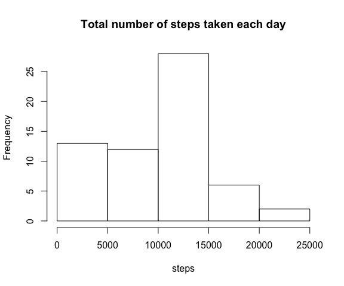
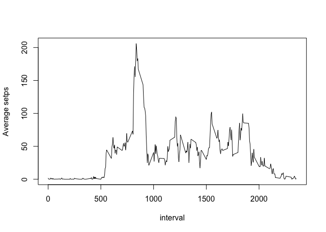
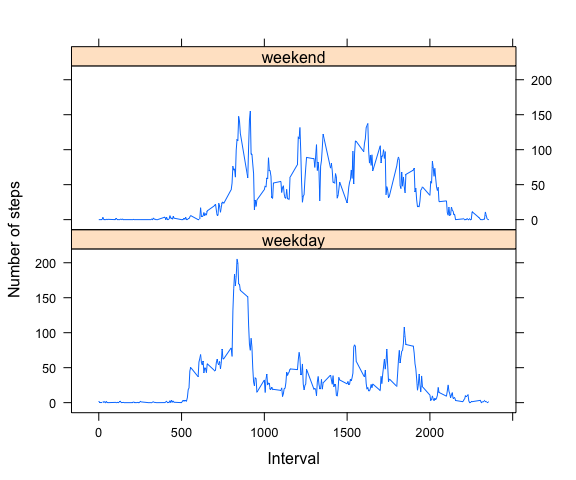

# Reproducible Research: Peer Assessment 1

Loading libraries


```r
library(dplyr)
library(lattice)
```

## Loading and preprocessing the data

Dataset is loaded into object `data`.


```r
unzip('activity.zip')
data = read.csv('activity.csv', stringsAsFactors = T) %>% 
  mutate(clock = sprintf('%02d:%02d', floor(interval/100), interval %% 100),
         time = as.Date(sprintf("%s %s", date ,clock), format="%Y-%m-%d %H:%M"),
         date = as.Date(date)) %>% tbl_df
data
```

```
## Source: local data frame [17,568 x 5]
## 
##    steps       date interval clock       time
##    (int)     (date)    (int) (chr)     (date)
## 1     NA 2012-10-01        0 00:00 2012-10-01
## 2     NA 2012-10-01        5 00:05 2012-10-01
## 3     NA 2012-10-01       10 00:10 2012-10-01
## 4     NA 2012-10-01       15 00:15 2012-10-01
## 5     NA 2012-10-01       20 00:20 2012-10-01
## 6     NA 2012-10-01       25 00:25 2012-10-01
## 7     NA 2012-10-01       30 00:30 2012-10-01
## 8     NA 2012-10-01       35 00:35 2012-10-01
## 9     NA 2012-10-01       40 00:40 2012-10-01
## 10    NA 2012-10-01       45 00:45 2012-10-01
## ..   ...        ...      ...   ...        ...
```

## What is mean total number of steps taken per day?


```r
steps.by.day = data %>% 
  group_by(date) %>%
  summarise(
    total = sum(steps, na.rm=T) )
steps.by.day
```

```
## Source: local data frame [61 x 2]
## 
##          date total
##        (date) (int)
## 1  2012-10-01     0
## 2  2012-10-02   126
## 3  2012-10-03 11352
## 4  2012-10-04 12116
## 5  2012-10-05 13294
## 6  2012-10-06 15420
## 7  2012-10-07 11015
## 8  2012-10-08     0
## 9  2012-10-09 12811
## 10 2012-10-10  9900
## ..        ...   ...
```


```r
hist(steps.by.day[['total']], main='Total number of steps taken each day', xlab='steps')
```

 

Calculated mean and median for number of steps taken each day.


```r
steps.by.day %>% 
  summarise(
    mean = mean(total),
    median = median(total) )
```

```
## Source: local data frame [1 x 2]
## 
##      mean median
##     (dbl)  (int)
## 1 9354.23  10395
```

## What is the average daily activity pattern?


```r
steps.by.interval = data %>% 
  group_by(interval) %>%
  summarise(
    mean = mean(steps, na.rm=T),
    median = median(steps, na.rm=T))
with(steps.by.interval, plot(interval, mean, type='l', ylab='Average setps'))
```

 

The maximum number of steps is obtained at


```r
subset(steps.by.interval, mean == max(mean))
```

```
## Source: local data frame [1 x 3]
## 
##   interval     mean median
##      (int)    (dbl)  (int)
## 1      835 206.1698     19
```

## Imputing missing values

The table has 2304 rows with missing data `NA`.


```r
table(complete.cases(data))
```

```
## 
## FALSE  TRUE 
##  2304 15264
```

To impute the 2304 row I going to use the median calculated in the corresponding 5 minute period.


```r
data.imp = left_join(data, steps.by.interval, by='interval') %>%
  mutate(
    steps = ifelse(is.na(steps), median , steps) ) %>%
  select_(.dots = names(data))
data.imp
```

```
## Source: local data frame [17,568 x 5]
## 
##    steps       date interval clock       time
##    (int)     (date)    (int) (chr)     (date)
## 1      0 2012-10-01        0 00:00 2012-10-01
## 2      0 2012-10-01        5 00:05 2012-10-01
## 3      0 2012-10-01       10 00:10 2012-10-01
## 4      0 2012-10-01       15 00:15 2012-10-01
## 5      0 2012-10-01       20 00:20 2012-10-01
## 6      0 2012-10-01       25 00:25 2012-10-01
## 7      0 2012-10-01       30 00:30 2012-10-01
## 8      0 2012-10-01       35 00:35 2012-10-01
## 9      0 2012-10-01       40 00:40 2012-10-01
## 10     0 2012-10-01       45 00:45 2012-10-01
## ..   ...        ...      ...   ...        ...
```

The histogram


```r
steps.by.day.imp = data.imp %>% 
  group_by(date) %>%
  summarise(
    total = sum(steps, na.rm=T) )
```


```r
hist(steps.by.day.imp[['total']], main='Total number of steps taken each day', xlab='steps')
```

 

  * Before imputation
  

```r
steps.by.day %>% 
  summarise(
    mean = mean(total),
    median = median(total) )
```

```
## Source: local data frame [1 x 2]
## 
##      mean median
##     (dbl)  (int)
## 1 9354.23  10395
```

  * After imputation
  

```r
steps.by.day.imp %>% 
  summarise(
    mean = mean(total),
    median = median(total) )
```

```
## Source: local data frame [1 x 2]
## 
##       mean median
##      (dbl)  (int)
## 1 9503.869  10395
```

> After imputation we have seen that the estimate of the mean differs.

## Are there differences in activity patterns between weekdays and weekends?


```r
data.imp = data.imp %>% 
  mutate(
    period = ifelse(weekdays(date) %in% c('Saturday', 'Sunday'), 'weekend', 'weekday') )
steps.by.interval_period.imp = data.imp %>% 
  group_by(interval, period) %>%
  summarise(
    mean = mean(steps, na.rm=T),
    median = median(steps, na.rm=T))
```


```r
xyplot(mean~interval|period, data=steps.by.interval_period.imp, type='l', 
       layout=c(1,2), ylab='Number of steps', xlab='Interval')
```

 
